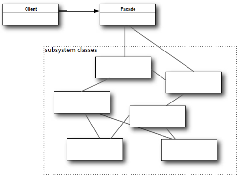

## What
* General solutions (heuristics) that can be used to solve similar problems
* 3 Categories
    * Creational
        * For object creation
    * Structural
        * Structure of code
    * Behavioural
        * How code behaves

## Examples
### Singleton (Creational)
* Ensure only one global instance for a class
* final class (prevent extension), Private instance, private constructor (prevent use of new` and new instances), public method  


```java
final class Manager {
    private static Manager manager;
    private Manager() {
        ...
    }
    public static Manager getInstance() {
        if(manager == null) {
            manager = new Manager();
        }
        return manager;
    }
}
```

### Factory Method (Creational)
* Interface for creating an object, but subclasses can decide which class to instantiate
* Conforms to DIP


### Facade (Structural)
* Hide complexities of code and provide unified interface for set of interfaces in subsystem
* Interface for clients should be kept simple



### Adapter (Structural)
* Let classes of incompatible interfaces work together that couldn't otherwise
* Used when we have existing implementations that don't fit together but is too costly to reimplement

