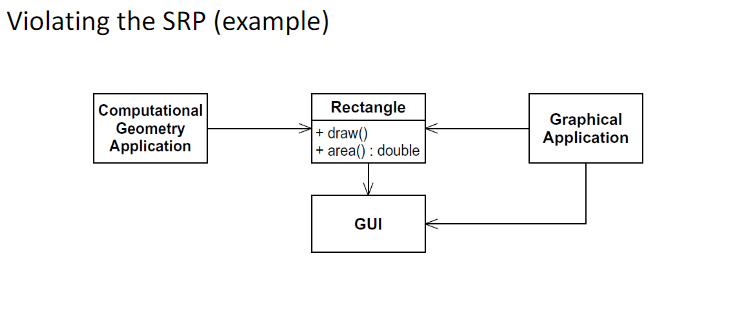
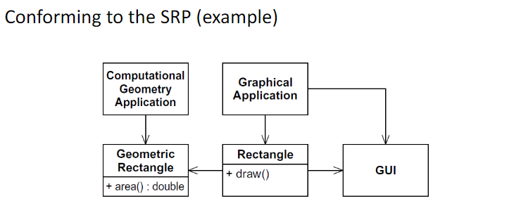

## Single Responsibility Principle
> A class should only *"do one thing"* or *"have the same theme"*

|  | Graphical responsibility of drawing, but also Computational responsibility for calculating area |
|---|---|
|  | **Splitting into 2 classes of Geometric Rectangle and Rectangle so each class has own single purpose** |

* Violation requires compiling GUI to compile for Computational Geometry Application

## Open/Closed Principle
> Software enitites (classes, modules, functions, ...) should be created so that new features can be done through extension (like a sub-class) rather than modification of the original code

* Avoid modifying existing code (eg. classes, interfaces, ...))
    * Can create dependency problems

## Liskow Substitution Principle

## Interface Segregation Principle
> Interfaces should include common and cohesive methods that should be shared by all the classes (so that dummy or useless implementations unneeded)

## Dependency Inversion Principle
> Make sure that abstractions do not depend on concrete items and vice versa