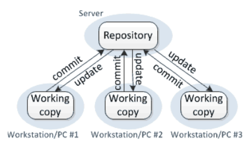
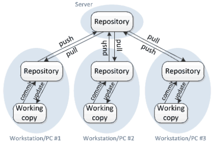
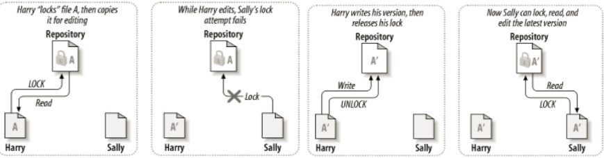

# Version Control
* To record all changes made to code
---

# Centralized - SVN

* stores copies of files and deltas (revision number) which are computed as the difference of the current version and last commited version
* `svn checkout [URL]` a specific copy of a project to work on it
* `svn add [FILES]` then `svn commit -m [MESSAGE]` to add changes
* older versions can be updated to the new version by following the same commited set of changes

### Advantages
* easier to manage

### Disadvantages
* 2 concurrent workers can cause issues (if no good method as made)
* Single point of failure
* Every change requires a connection to the server
---
# Distributed - Git

* `pull` copy of server repo to local repo
* `push` from local repo to server
  * addresses single point of failure (SVN disadvantage 1)
  * addresses need for communication with server (DIsadvantage 2)

---
# Managing Concurrency
## 1. Pessimistic Concurrency
* only one user allowed to modify at a time

## 2. Optimistic Concurrency
* allows for multiple concurrent users
* first person commits without issues
  * later users will get **out-of-date** errors if they try to commit with conflicting files and wrong version (unupdated)
  * `svn update` to get options (different ways) to resolve error/merge the code
  * then `svn commit`

---
# Branching
* Copies of development line for splitting and making changes that are not in the main line
* Feature branching: testing features that may fail
* Release branching: for different developers to develop on different releases/versions of software 
* SVN: `svn copy`

# Storage
* SVN: stores incremental differences (deltas)
* Git: stores snapshots/state of whole project (without saving copies of existing files by instead using a link to the previous identical file)
* Client side: Special hidden directory that saves all information needed for version control (.svn, .git)

# Rules of Thumb
1. Commit frequently
2. Don't break main branch
3. Clear commit messages
4. Test before merge
5. Communicate with team